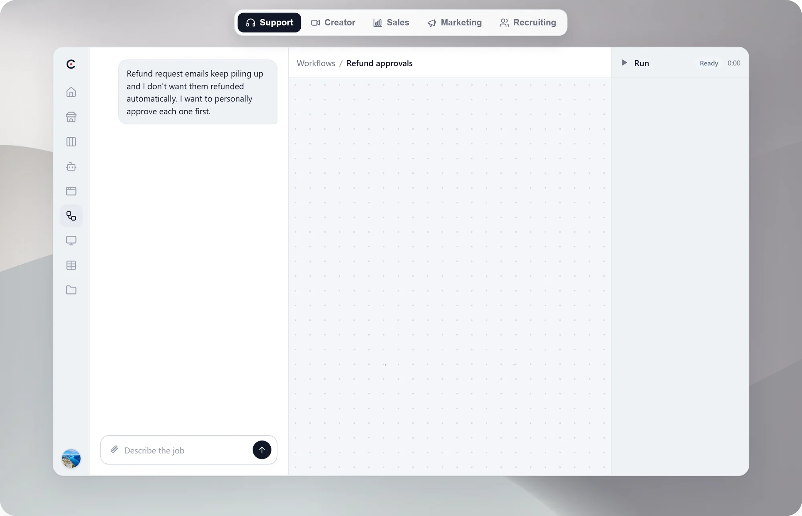
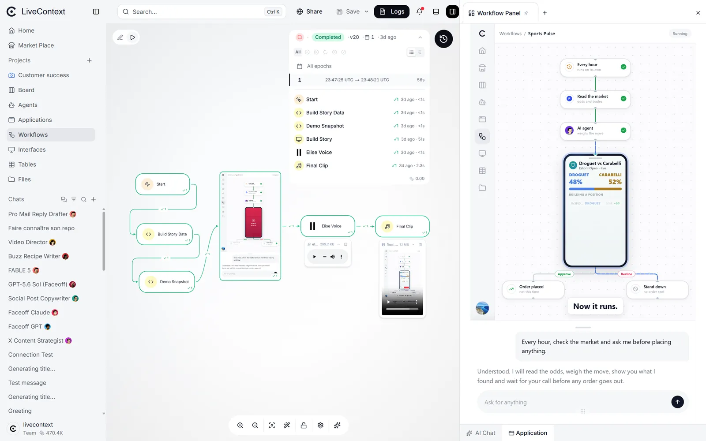
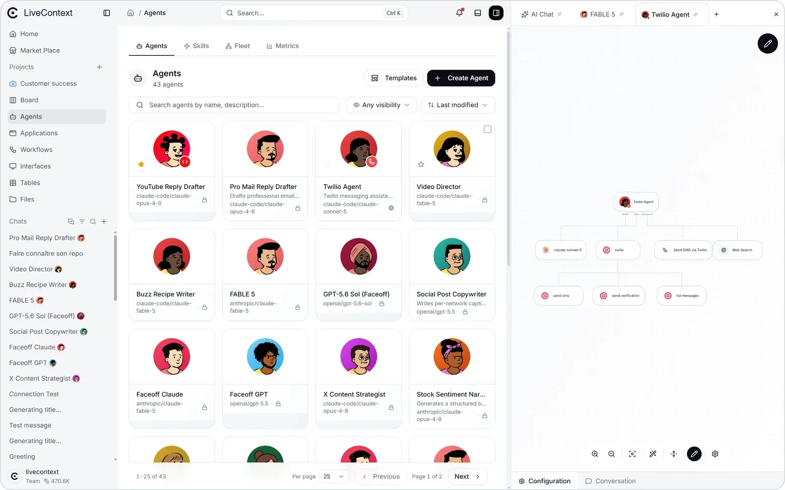
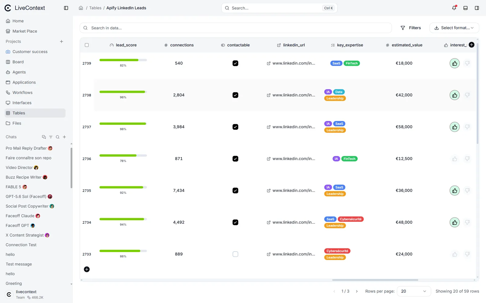

# LiveContext

**The AI automation platform.** One message in, a working automation out.

Describe the job in chat and LiveContext builds it in front of you: a workflow you can read,
AI agents with scoped access and budgets you control, and a small app your team actually uses.
Chat, Workflow, Agent and App in one self-hosted platform. No code to write, nothing to stitch together.

**An open-source, self-hosted alternative to n8n, Zapier and Make, with AI agents built in.**

[](https://github.com/livecontext-ai/livecontext-ce/stargazers)
[](https://github.com/livecontext-ai/livecontext-ce/releases/latest)
[](https://github.com/livecontext-ai/livecontext-ce/discussions)
[](LICENSE)


<a href="https://livecontext.ai">
  <picture>
    <source media="(prefers-color-scheme: dark)" srcset="frontend/public/landing/readme/hero-dark.webp" />
    
  </picture>
</a>

<sub>The builder, built by chat: one message in, a working automation out. Five real scenarios, one loop. <a href="frontend/public/landing/readme/hero-light.mp4">Watch it full size</a> &middot; <a href="https://livecontext.ai">Try the hosted version</a></sub>

<sub>⭐ If LiveContext looks useful, <a href="https://github.com/livecontext-ai/livecontext-ce">give it a star</a>. It helps other teams find it.</sub>

## Build it once. It runs as all four.

Most teams wire together a chatbot, an automation tool, an app builder and an agent framework.
LiveContext is all four on one canvas, every agent scoped, budgeted and audited, and you can see
exactly what each one did. The chat (shown above) builds it; here is what it runs as:

<table>
  <tr>
    <td width="50%" valign="top" align="center">
      <a href="frontend/public/landing/hero-stack/workflow-app.webp"></a>
      <br/><b>Workflow + App</b><br/>
      The workflow and the app it drives, in one view. Draw the automation as a readable graph, then wrap it in a real interface: forms, dashboards and live approval screens your team or an agent can act on.
    </td>
    <td width="50%" valign="top" align="center">
      <a href="frontend/public/landing/hero-stack/agent.webp"></a>
      <br/><b>Agents</b><br/>
      A fleet of scoped agents, one per job: each with its own model, tools, files, credit budget and full audit trail. No black box.
    </td>
  </tr>
  <tr>
    <td width="50%" valign="top" align="center">
      <a href="frontend/public/landing/hero-stack/table.webp"></a>
      <br/><b>Tables</b><br/>
      Built-in data tables your workflows and agents read, write and enrich. Filter, search and export, with no external database to wire up.
    </td>
    <td width="50%" valign="top" align="center">
      <a href="frontend/public/landing/hero-stack/data-metrics.webp"></a>
      <br/><b>Data &amp; metrics</b><br/>
      Every run charted: calls, tokens, success rate and duration, sliced per agent and per tool. Spot a regression and drill straight into it.
    </td>
  </tr>
</table>

> The workflow decides exactly what each agent sees and what it ships, so the same job runs at a
> fraction of the cost of a do-everything agent, every step is auditable, and your business never
> sits inside a black box.

This repository is the **Community Edition (CE)**: the full platform as a single self-hosted service
(see [LICENSE](LICENSE)). It is free to self-host and use in production inside your organization.

## Requirements

- Docker Engine 24+ with Compose v2 (or Docker Desktop 4.x and later)
- 4 GB RAM minimum, 8 GB recommended

## Quick start

```bash
# From the repo root:
docker compose up -d

# Watch it come up. The "livecontext" service runs database migrations and registers
# its tools on first boot; wait until it reports "healthy" and "frontend" is up:
docker compose ps
```

Then open **http://localhost:3000** and create the first account (the first user becomes the admin).
Two optional add-ons (interface screenshots/PDFs, and a browser agent with web search) are one env
file away when you want them, see [Optional features](#optional-features) below.

Configuration (LLM keys, SMTP, ports) is documented in [docker/README-CE.md](docker/README-CE.md).
Copy `docker/.env.ce.example` to set your own values, and never commit it.

## Optional features

Two heavy features are **opt-in** and start with no container by default, keeping the base stack
light. Each is enabled by a bundled env file (it turns on both the Docker profile and the matching
app setting in one shot):

- **Interface screenshots and PDFs** (`renderer` profile). Adds a headless Playwright/Chromium
  sidecar (~1 GB image) so interface nodes can render a PNG screenshot or a PDF. Enable it with:
  ```bash
  docker compose --env-file docker/.env.ce.renderer up -d
  ```
- **Browser agent and web search** (`browser-agent` profile). Adds a Chromium browser-use container
  plus a SearXNG metasearch sidecar (~2 GB) so agents can browse pages (`agent_browse`) and run
  `web_search`. Enable it with:
  ```bash
  docker compose --env-file docker/.env.ce.browser-agent up -d
  ```

Run both by passing both env files (repeat `--env-file`). See [docker/README-CE.md](docker/README-CE.md)
for details and tuning.

## What's in the box

- **Workflow engine.** Visual builder and execution engine with parallel branches, loops, signals,
  human-approval steps, and triggers (schedule, webhook, chat, form, datasource).
- **AI agents.** Chat agents that design, build and run workflows, with per-workspace skills, scoped
  tool access, per-agent credit budgets and per-agent metrics.
- **Integration catalog.** 600+ ready-made integrations seeded at first boot, fully offline. Add your
  own as OpenAPI specs.
- **Interfaces and apps.** Small web pages served by your workflows (forms, dashboards, approval
  screens), shareable as standalone apps.
- **Tables.** Built-in data tables your workflows and agents can read and write.
- **One backend.** All backend services run as a single monolith JAR, with PostgreSQL, Redis, an
  S3-compatible object store and a lightweight tools bridge as its dependencies, plus the Next.js
  frontend. It all comes up with one `docker compose up`.

## Why self-host LiveContext

- **You stay in control.** Per-agent credit budgets, scoped access, a full audit trail and per-agent
  metrics. No black box.
- **Far fewer tokens.** The workflow constrains exactly what each agent sees and ships, so jobs cost a
  fraction of a do-everything agent.
- **Org-grade access.** Organizations and workspaces with role-based access control.
- **Yours to run.** The same platform on your own infrastructure.

## Managed version

Prefer not to run your own infrastructure? The managed service, with an always-current integration
catalog and hosted account management, lives at **[livecontext.ai](https://livecontext.ai)**. Those
hosted-only features are not part of the Community Edition.

## Building from source

CE runs from prebuilt images (the Quick start above pulls them). The full source is in this repo.
To build the images yourself instead of pulling, use the per-service Dockerfiles:
`backend/monolith-service/Dockerfile` (Java 21, the `ce` Maven profile), `frontend/Dockerfile`
(Node 20), and `mcp/bridge/Dockerfile`.

## Security

Please report vulnerabilities privately. See [SECURITY.md](SECURITY.md).

## License

LiveContext CE is licensed under the **GNU Affero General Public License v3.0
(AGPL-3.0)**, see [LICENSE](LICENSE). You are free to use, self-host, modify and
redistribute it, including commercially. One condition matters most: if you run a
modified version as a network service, the AGPL requires you to make the
corresponding source of your changes available to that service's users.

The **LiveContext** name and logo are trademarks of their owner and are not
covered by the AGPL, see [TRADEMARKS](TRADEMARKS). Third-party components ship
under their own licenses, see [NOTICE](NOTICE) and
[THIRD_PARTY_NOTICES](THIRD_PARTY_NOTICES).

---

⭐ **If LiveContext is useful to you, star the repo.** It is the simplest way to help other teams
discover it, and it means a lot to a small team. Questions or ideas? Open a
[Discussion](https://github.com/livecontext-ai/livecontext-ce/discussions).
