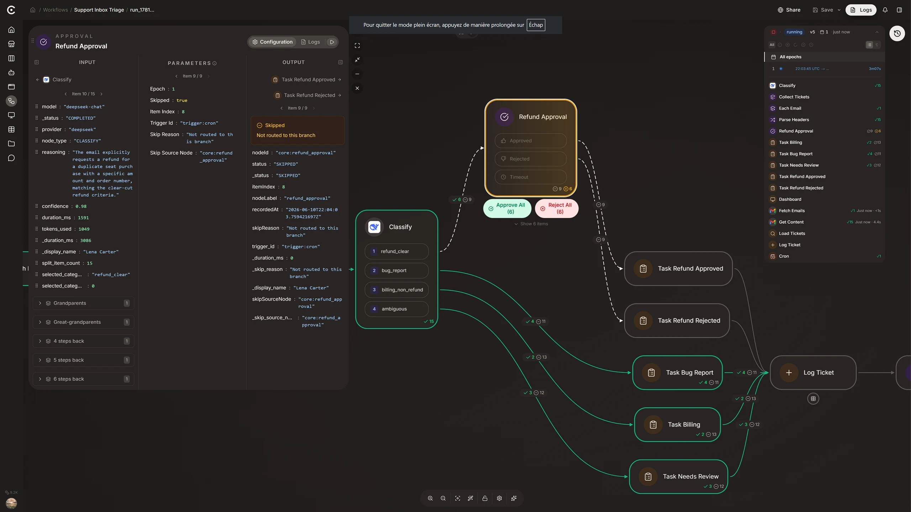
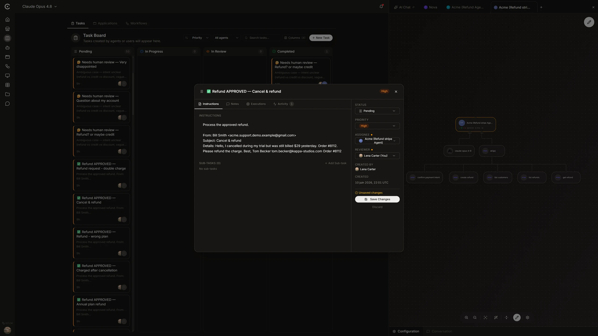
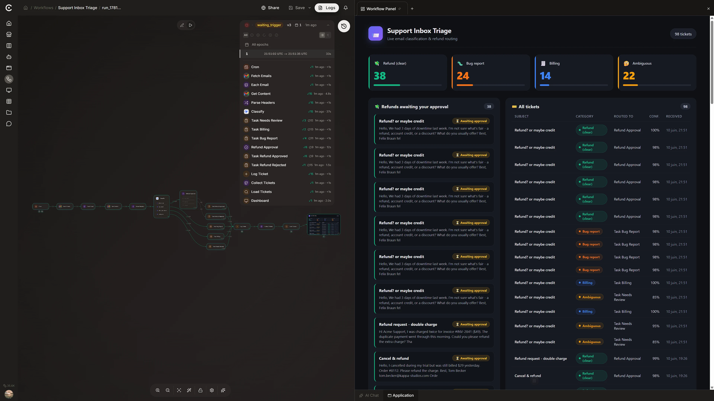
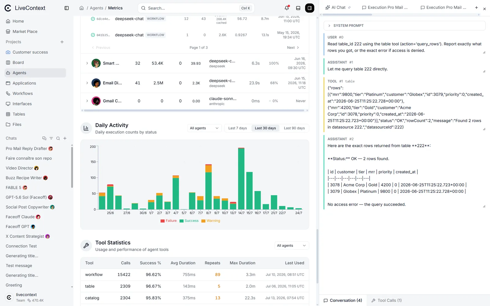

# LiveContext

**The AI automation platform.** One message in, a working automation out.

Describe the job in chat and LiveContext builds it in front of you: a workflow you can read,
AI agents with scoped access and budgets you control, and a small app your team actually uses.
Chat, Workflow, Agent and App in one self-hosted platform. No code to write, nothing to stitch together.


[](https://livecontext.ai)

<sub>The builder, built by chat. <a href="frontend/public/landing/videos/builder-built-by-chat.mp4">Watch the full demo</a> &middot; <a href="https://livecontext.ai">Try the hosted version</a></sub>

## Build it once. It runs as all four.

Most teams wire together a chatbot, an automation tool, an app builder and an agent framework.
LiveContext is all four on one canvas, every agent scoped, budgeted and audited, and you can see
exactly what each one did. The chat (shown above) builds it; here is what it runs as:

<table>
  <tr>
    <td width="50%" valign="top" align="center">
      <a href="frontend/public/landing/hero-stack/mechanism-workflow.webp"></a>
      <br/><b>Workflow</b><br/>
      50+ blocks: branching, loops, parallel fan-out, sub-workflows, code, HTTP and AI. Readable at 50 steps.
    </td>
    <td width="50%" valign="top" align="center">
      <a href="frontend/public/landing/hero-stack/mechanism-agent.webp"></a>
      <br/><b>Agents</b><br/>
      Scoped tool access, per-agent credit budgets and a full audit trail. No black box.
    </td>
  </tr>
  <tr>
    <td width="50%" valign="top" align="center">
      <a href="frontend/public/landing/hero-stack/mechanism-app.webp"></a>
      <br/><b>App</b><br/>
      Ship small web interfaces (forms, dashboards, approval screens) driven by your workflows.
    </td>
    <td width="50%" valign="top" align="center">
      <a href="frontend/public/landing/hero-stack/data-metrics.webp"></a>
      <br/><b>Data &amp; metrics</b><br/>
      Per-agent metrics, run history and cost tracking: see exactly what every agent did and spent.
    </td>
  </tr>
</table>

> The workflow decides exactly what each agent sees and what it ships, so the same job runs at a
> fraction of the cost of a do-everything agent, every step is auditable, and your business never
> sits inside a black box.

This repository is the **Community Edition (CE)**: the full platform as a single self-hosted service
(see [LICENSE](LICENSE)). It is free to self-host and use in production inside your organization.

## Requirements

- Docker Engine 24+ with Compose v2 (or Docker Desktop 4.x and later)
- 4 GB RAM minimum, 8 GB recommended

For agents to run, connect your instance to **LiveContext Cloud** (recommended: managed model
access, nothing to set up) or add your own OpenAI / Anthropic / Google key in the app.

## Quick start

```bash
# From the repo root:
docker compose up -d

# Watch it come up. The "livecontext" service runs database migrations and registers
# its tools on first boot; wait until it reports "healthy" and "frontend" is up:
docker compose ps
```

Then open **http://localhost:3000** and create the first account (the first user becomes the admin).

Configuration (LLM keys, SMTP, ports) is documented in [docker/README-CE.md](docker/README-CE.md).
Copy `docker/.env.ce.example` to set your own values, and never commit it.

## Optional features

Two heavy features are **opt-in** and start with no container by default, keeping the base stack
light. Each is enabled by a bundled env file (it turns on both the Docker profile and the matching
app setting in one shot):

- **Interface screenshots and PDFs** (`renderer` profile). Adds a headless Playwright/Chromium
  sidecar (~1 GB image) so interface nodes can render a PNG screenshot or a PDF. Enable it with:
  ```bash
  docker compose --env-file docker/.env.ce.renderer up -d
  ```
- **Browser agent and web search** (`browser-agent` profile). Adds a Chromium browser-use container
  plus a SearXNG metasearch sidecar (~2 GB) so agents can browse pages (`agent_browse`) and run
  `web_search`. The browser agent uses whichever model you pick per AI provider, relayed through
  your cloud connection when the install is cloud-linked (like the other agents), or a direct
  provider key added in the app otherwise. Enable it with:
  ```bash
  docker compose --env-file docker/.env.ce.browser-agent up -d
  ```

Run both by passing both env files (repeat `--env-file`). See [docker/README-CE.md](docker/README-CE.md)
for details and tuning.

## What's in the box

- **Workflow engine.** Visual builder and execution engine with parallel branches, loops, signals,
  human-approval steps, and triggers (schedule, webhook, chat, form, datasource).
- **AI agents.** Chat agents that design, build and run workflows, with per-workspace skills, scoped
  tool access, per-agent credit budgets and per-agent metrics.
- **Integration catalog.** 600+ ready-made integrations seeded at first boot, fully offline. Add your
  own as OpenAPI specs.
- **Interfaces and apps.** Small web pages served by your workflows (forms, dashboards, approval
  screens), shareable as standalone apps.
- **Tables.** Built-in data tables your workflows and agents can read and write.
- **One backend.** All backend services run as a single monolith JAR, with PostgreSQL, Redis, an
  S3-compatible object store and a lightweight tools bridge as its dependencies, plus the Next.js
  frontend. It all comes up with one `docker compose up`.

## Why self-host LiveContext

- **You stay in control.** Per-agent credit budgets, scoped access, a full audit trail and per-agent
  metrics. No black box.
- **Far fewer tokens.** The workflow constrains exactly what each agent sees and ships, so jobs cost a
  fraction of a do-everything agent.
- **Org-grade access.** Organizations and workspaces with role-based access control.
- **Yours to run.** The same platform on your own infrastructure.

## Managed version

Prefer not to run your own infrastructure? The managed service, with an always-current integration
catalog and hosted account management, lives at **[livecontext.ai](https://livecontext.ai)**. Those
hosted-only features are not part of the Community Edition.

## Building from source

CE runs from prebuilt images (the Quick start above pulls them). The full source is in this repo.
To build the images yourself instead of pulling, use the per-service Dockerfiles:
`backend/monolith-service/Dockerfile` (Java 21, the `ce` Maven profile), `frontend/Dockerfile`
(Node 20), and `mcp/bridge/Dockerfile`.

## Security

Please report vulnerabilities privately. See [SECURITY.md](SECURITY.md).

## License

See [LICENSE](LICENSE) and [NOTICE](NOTICE).
