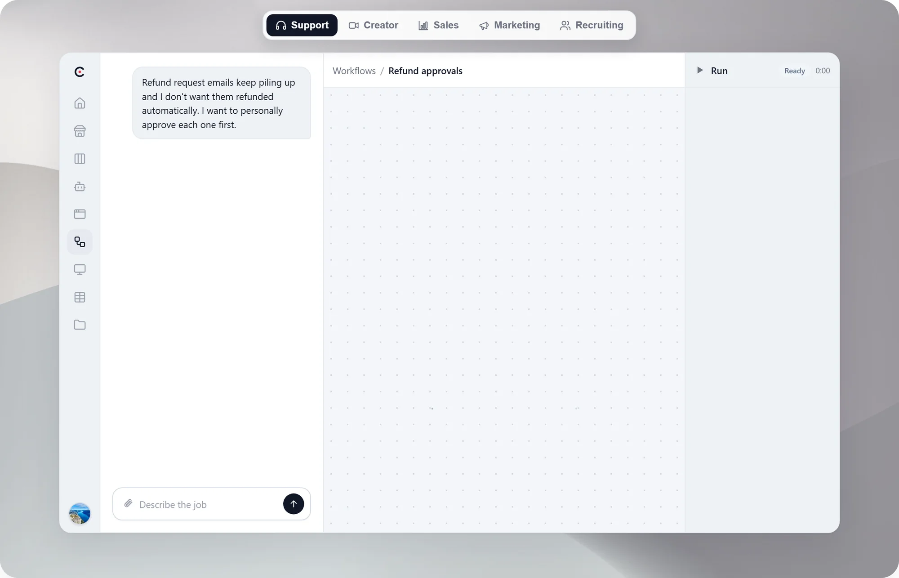
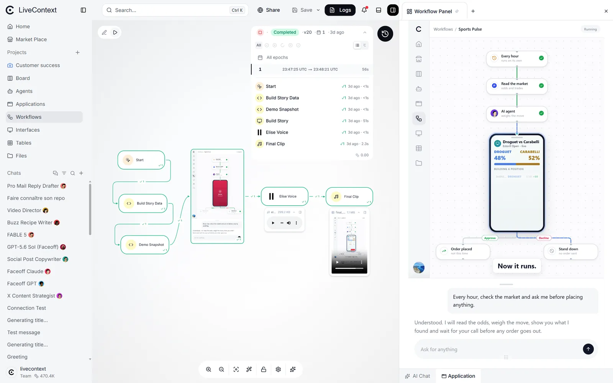
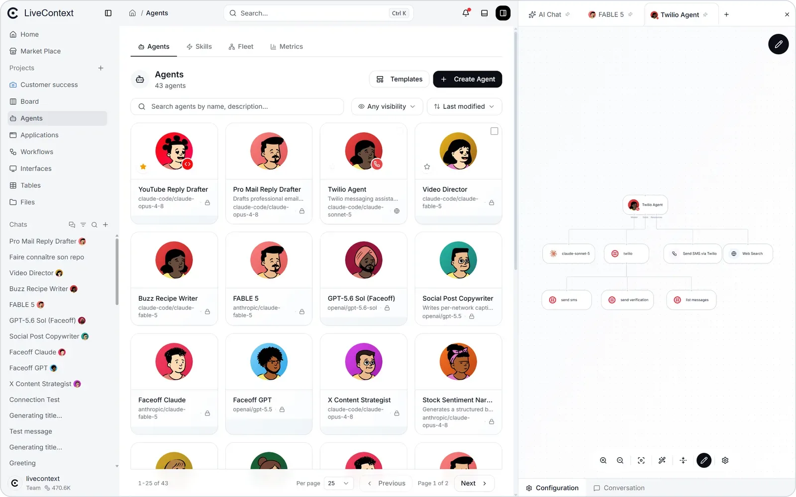
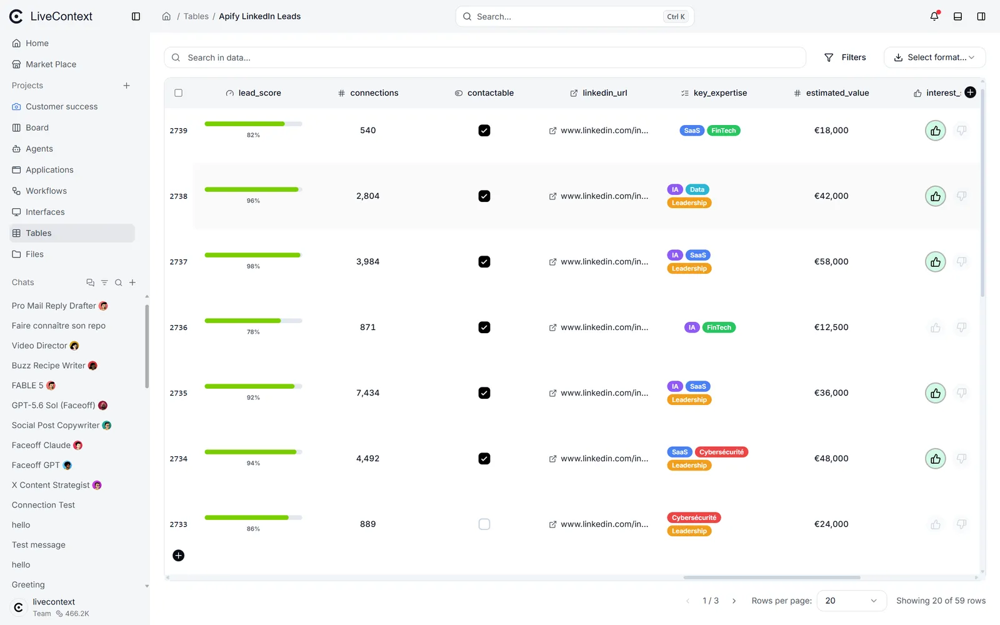
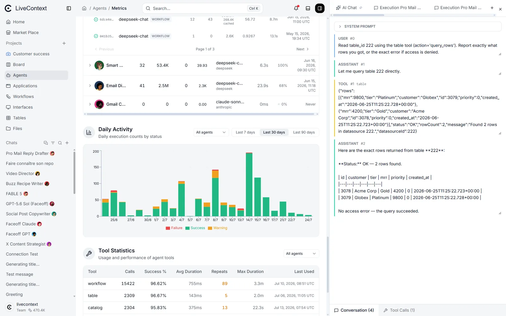

# LiveContext

**The AI automation platform.** One message in, a working automation out.

Describe the job in chat and LiveContext builds it in front of you: a workflow you can read,
AI agents with scoped access and budgets you control, and a small app your team actually uses.
Chat, Workflow, Agent and App in one self-hosted platform. No code to write, nothing to stitch together.

**A source-available, self-hosted alternative to n8n, Zapier and Make, with AI agents built in.**

[](https://github.com/livecontext-ai/livecontext-ce/stargazers)
[](https://github.com/livecontext-ai/livecontext-ce/releases/latest)
[](https://github.com/livecontext-ai/livecontext-ce/discussions)
[](LICENSE)


<a href="https://livecontext.ai">
  <picture>
    <source media="(prefers-color-scheme: dark)" srcset="frontend/public/landing/readme/hero-dark.webp" />
    
  </picture>
</a>

<sub>The builder, built by chat: one message in, a working automation out. Five real scenarios, one loop. <a href="frontend/public/landing/readme/hero-light.mp4">Watch it full size</a> &middot; <a href="https://livecontext.ai">Try the hosted version</a></sub>

<sub>⭐ If LiveContext looks useful, <a href="https://github.com/livecontext-ai/livecontext-ce">give it a star</a>. It helps other teams find it.</sub>

## Build it once. It runs as all four.

Most teams wire together a chatbot, an automation tool, an app builder and an agent framework.
LiveContext is all four on one canvas, every agent scoped, budgeted and audited, and you can see
exactly what each one did. The chat (shown above) builds it; here is what it runs as:

<table>
  <tr>
    <td width="50%" valign="top" align="center">
      <a href="frontend/public/landing/hero-stack/workflow-app.webp"><picture><source media="(prefers-color-scheme: dark)" srcset="frontend/public/landing/hero-stack/workflow-app-dark.webp" /></picture></a>
      <br/><b>Workflow + App</b><br/>
      The workflow and the app it drives, in one view. Draw the automation as a readable graph, then wrap it in a real interface: forms, dashboards and live approval screens your team or an agent can act on.
    </td>
    <td width="50%" valign="top" align="center">
      <a href="frontend/public/landing/hero-stack/agent.webp"><picture><source media="(prefers-color-scheme: dark)" srcset="frontend/public/landing/hero-stack/agent-dark.webp" /></picture></a>
      <br/><b>Agents</b><br/>
      A fleet of scoped agents, one per job: each with its own model, tools, files, credit budget and full audit trail. No black box.
    </td>
  </tr>
  <tr>
    <td width="50%" valign="top" align="center">
      <a href="frontend/public/landing/hero-stack/table.webp"><picture><source media="(prefers-color-scheme: dark)" srcset="frontend/public/landing/hero-stack/table-dark.webp" /></picture></a>
      <br/><b>Tables</b><br/>
      Built-in data tables your workflows and agents read, write and enrich. Filter, search and export, with no external database to wire up.
    </td>
    <td width="50%" valign="top" align="center">
      <a href="frontend/public/landing/hero-stack/data-metrics.webp"><picture><source media="(prefers-color-scheme: dark)" srcset="frontend/public/landing/hero-stack/data-metrics-dark.webp" /></picture></a>
      <br/><b>Data &amp; metrics</b><br/>
      Every run charted: calls, tokens, success rate and duration, sliced per agent and per tool. Spot a regression and drill straight into it.
    </td>
  </tr>
</table>

> The workflow decides exactly what each agent sees and what it ships, so the same job runs at a
> fraction of the cost of a do-everything agent, every step is auditable, and your business never
> sits inside a black box.

This repository is the **Community Edition (CE)**: the full platform as a single self-hosted service
(see [LICENSE](LICENSE)). It is free to self-host and use in production inside your organization.

## Requirements

- A machine supported by the release images; see [Images](#images) before choosing ARM hardware.
- Docker Engine 24+ with Compose v2, or Docker Desktop with Linux containers, installed and running.
- 4 GB RAM minimum, 8 GB recommended; allow several GB of free disk space for the images and your data.
- For the npm launcher: Node.js LTS with npm (`node --version`, `npm --version`).
- For the repository installation: Git (`git --version`). Java and Maven are not needed to run the prebuilt images.
- For AI features: a connected LiveContext Cloud account or your own supported provider key. Provider usage may incur charges.

## Quick start

Choose one installation method. Do not run both on the same machine at the same time: they use the same container names and default ports.

### Option 1: npm launcher, for a local installation

Run this from the directory where you want to keep the installation configuration:

```bash
npx livecontext@latest
```

The launcher pulls the images, starts Docker Compose and prints the app URL, normally **http://localhost:3000**.
Keep using this same directory for `npx livecontext@latest status`, `logs`, `down` and `update`.
Configuration is in `./livecontext`; application data is in Docker volumes. Deleting that directory does not reset the database.
For settings, copy `livecontext/.env.example` to `livecontext/.env`, edit it and run the launcher again.
The [CLI guide](cli/README.md) explains management and limitations. Use Option 2 if you need the optional add-ons.

### Option 2: Docker Compose, for local or server installations

```bash
git clone https://github.com/livecontext-ai/livecontext-ce.git
cd livecontext-ce
cp docker/.env.ce.example .env
```

Before the first start on a server, edit `.env`: set your own `DB_PASSWORD` and MinIO credentials. Then start:

```bash
docker compose up -d
docker compose ps
```

These commands also work in PowerShell (`cp` is an alias for `Copy-Item`). Compose reads `.env` automatically.
Leave the encryption settings commented so the first boot generates and persists its keys.
Do not change database credentials or encryption keys on an existing installation without a migration and backup.

The first start downloads several GB and initializes the database. Wait for `livecontext` to become **healthy** and `frontend` to start; downloads can take longer than initialization.
Then open **http://localhost:3000**, or the port you set with `FRONTEND_PORT` in `.env`.
If it is not ready, run `docker compose logs --tail=100 livecontext frontend` and see [Troubleshooting](docker/README-CE.md#troubleshooting).

### First account and first AI request

1. Create the first account; it becomes the installation administrator. Complete the setup shown in the app.
2. Connect LiveContext Cloud, or add your own provider key in **Settings > AI providers** and select an available model.
3. Open Chat, select that model and send a short request such as "Reply with hello" before building an automation.
4. Connect the integrations required by your automation when prompted. Installing the catalog does not connect your external accounts.

Configure SMTP before relying on password resets or invitation emails. The [configuration guide](docker/README-CE.md#e-mail-smtp) explains the relay and public URL settings.

### Running it on a server, NAS or VPS

On a trusted LAN, publish the web port (3000) and backend port (8080), and open `http://<server-address>:3000`.
Set `PUBLIC_BASE_URL=http://<server-address>:3000` and `GATEWAY_PUBLIC_URL=http://<server-address>:8080` in `.env` so email links and OAuth callbacks also return to that server. Do not add a trailing slash.

For internet access, use HTTPS. A straightforward setup uses two HTTPS hostnames: proxy the app hostname to port 3000 and the API hostname to port 8080, including WebSocket upgrades. Set `PUBLIC_BASE_URL=https://app.example.com` and `GATEWAY_PUBLIC_URL=https://api.example.com`, then restart with `docker compose up -d`.
The browser must be able to reach both hostnames. Limit direct access to the underlying ports to your proxy where appropriate.
A single-origin proxy needs explicit API and WebSocket routing; changing only the URL does not create those routes.

See [server setup](docker/README-CE.md#server-and-reverse-proxy-setup) and [deployment templates](templates/README.md) for details.

### Manage and update

For a repository installation, run these from the clone directory:

```bash
docker compose ps
docker compose logs --tail=100 livecontext frontend
docker compose down
```

`down` keeps Docker volumes. **`down -v` deletes the installation's data. Do not use it as a normal update or troubleshooting step.**
Before upgrading, [back up the data, keys and configuration](docker/README-CE.md#backup-and-recovery), then:

```bash
git pull --ff-only
docker compose pull
docker compose up -d
docker compose ps
```

The repository pins image versions, so pulling images without updating the repository does not select a newer release.
Keep settings in `.env`; if you edited tracked files and Git refuses the update, preserve and reconcile those changes rather than discarding them.

### Images

Prebuilt releases support **linux/amd64** (x86-64). **ARM64 support depends on the
release**: before installing on Apple Silicon, Raspberry Pi, Ampere or Graviton,
check that all four application images for that version include `linux/arm64`.
For example, inspect an image with `docker buildx imagetools inspect <image>:<version>`.
An amd64-only release does not provide native ARM64 images. Docker selects the
matching architecture only when that architecture was published.

The Compose file pulls these application images from GHCR:

```
ghcr.io/livecontext-ai/livecontext-ce
ghcr.io/livecontext-ai/livecontext-ce-frontend
ghcr.io/livecontext-ai/livecontext-ce-bridge
ghcr.io/livecontext-ai/livecontext-ce-screenshot-renderer   # opt-in renderer profile
```

Each release is tagged `vX.Y.Z` (immutable) plus `vX.Y`, `vX` and `latest` if you would
rather track a line than pin an exact version.

## Optional features

Use the repository installation. Both add-ons are off by default and need extra memory and disk space.
Keep the settings in the root `.env` so ordinary start, update and stop commands keep the same profiles.

For **interface screenshots and PDFs**, add:

```dotenv
COMPOSE_PROFILES=renderer
SCREENSHOT_RENDERER_URL=http://screenshot-renderer:8094
```

For the **browser agent and web search**, use:

```dotenv
COMPOSE_PROFILES=browser-agent
WEBSEARCH_ENABLED=true
```

To enable **both**, use one combined profile value, together with both settings:

```dotenv
COMPOSE_PROFILES=renderer,browser-agent
SCREENSHOT_RENDERER_URL=http://screenshot-renderer:8094
WEBSEARCH_ENABLED=true
```

Then run `docker compose up -d` and `docker compose ps`. The browser image builds on first use; the renderer pulls a prebuilt image. The browser agent also needs an available LLM provider.
Do not stack the two bundled `--env-file` examples without explicit profiles: the second `COMPOSE_PROFILES` value replaces the first.
See the [Docker guide](docker/README-CE.md#browser-agent-agent_browse---opt-in) for the legacy env-file commands and tuning.

## What's in the box

- **Workflow engine.** Visual builder and execution engine with parallel branches, loops, signals,
  human-approval steps, and triggers (schedule, webhook, chat, form, datasource).
- **AI agents.** Chat agents that design, build and run workflows, with per-workspace skills, scoped
  tool access, per-agent credit budgets and per-agent metrics.
- **Integration catalog.** 1000+ ready-made integrations seeded at first boot, fully offline. Add your
  own as OpenAPI specs.
- **Interfaces and apps.** Small web pages served by your workflows (forms, dashboards, approval
  screens), shareable as standalone apps.
- **Tables.** Built-in data tables your workflows and agents can read and write.
- **One backend.** All backend services run as a single monolith JAR, with PostgreSQL, Redis, an
  S3-compatible object store and a lightweight tools bridge as its dependencies, plus the Next.js
  frontend. It all comes up with one `docker compose up`.

## Why self-host LiveContext

- **You stay in control.** Per-agent credit budgets, scoped access, a full audit trail and per-agent
  metrics. No black box.
- **Far fewer tokens.** The workflow constrains exactly what each agent sees and ships, so jobs cost a
  fraction of a do-everything agent.
- **Org-grade access.** Organizations and workspaces with role-based access control.
- **Yours to run.** The same platform on your own infrastructure.

## Managed version

Prefer not to run your own infrastructure? The managed service, with an always-current integration
catalog and hosted account management, lives at **[livecontext.ai](https://livecontext.ai)**. Those
hosted-only features are not part of the Community Edition.

## Building from source

CE runs from prebuilt images (the Quick start above pulls them). The full source is in this repo.
To build the images yourself instead of pulling, use the per-service Dockerfiles:
`backend/monolith-service/Dockerfile` (Java 21, the `ce` Maven profile), `frontend/Dockerfile`
(Node 20), and `mcp/bridge/Dockerfile`.

## Security

Please report vulnerabilities privately. See [SECURITY.md](SECURITY.md).

## License

LiveContext CE is licensed under the **LiveContext Sustainable Use License
1.0**, see [LICENSE](LICENSE). You are free to use, self-host, modify and
redistribute it, including in production and for the internal business purposes
of your organization. One limitation matters: you may not offer it to third
parties on a hosted or embedded basis as a competing commercial product. For
anything outside that, write to oss@livecontext.ai.

The **LiveContext** name and logo are trademarks of their owner and are not
covered by the license, see [TRADEMARKS](TRADEMARKS.md). Third-party components
ship under their own licenses, see [NOTICE](NOTICE) and
[THIRD_PARTY_NOTICES](THIRD_PARTY_NOTICES.md).

---

⭐ **If LiveContext is useful to you, star the repo.** It is the simplest way to help other teams
discover it, and it means a lot to a small team. Questions or ideas? Open a
[Discussion](https://github.com/livecontext-ai/livecontext-ce/discussions).
